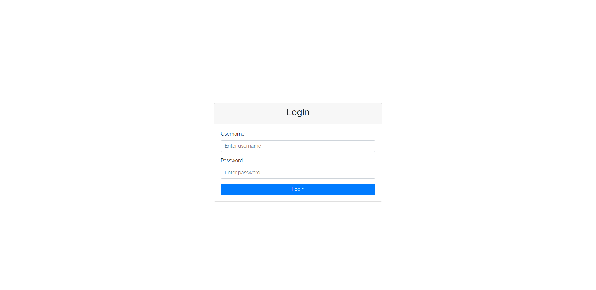

# 29. Learn Vue JS Use bootstrap in vue js (part 29)

- ## how to install bootstrap in vue js

  ### Step: 1 | write this code in the terminal

  ```js
  npm install bootstrap jquery popper.js
  ```

  ### Step: 2 | import the bootstrap file in the `main.js` Like this one

  ```js
  import "bootstrap";
  import "bootstrap/dist/css/bootstrap.css";
  ```

  ```js
  npm install bootstrap jquery popper.js
  ```


